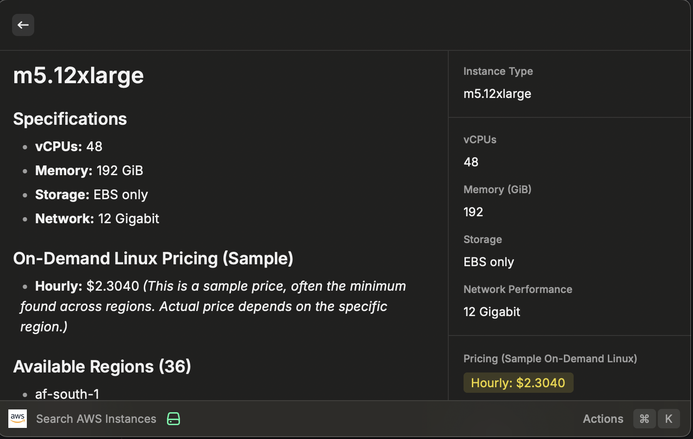

# Raycast AWS Instance Query

[](https://www.raycast.com)

A Raycast extension to quickly query AWS EC2 instance specifications, available regions, and sample pricing information directly from a local SQLite database.

## Features

* **Fast Instance Search:** Quickly search through AWS EC2 instance types (e.g., `t3.medium`, `m5.large`, `c7g.xlarge`).
* **View Core Specs:** See essential details like vCPUs, Memory (GiB), Storage type, and Network Performance.
* **Sample Pricing:** Get an idea of On-Demand Linux hourly pricing (based on the minimum price found across regions in the database).
* **Region Availability:** View a list of AWS regions where the selected instance type is available (according to the database).
* **Offline Access:** Works entirely offline using a local SQLite database file.




## Requirements

* [Raycast](https://www.raycast.com) (macOS application)
* `npm` (Node Package Manager) for building the extension.

## Installation

1.  **Clone the Repository:**
    ```bash
    git clone [https://github.com/hugoch/raycast-aws-query.git](https://github.com/hugoch/raycast-aws-query.git)
    cd raycast-aws-query
    ```
    *Alternatively, you can download a release ZIP file from the repository's releases page and extract it.*

2.  **Build the Extension:**
    * Open your terminal in the repository's root directory.
    * Install dependencies:
        ```bash
        npm install
        ```
    * Build the extension:
        ```bash
        npm run build
        ```
    * This will create a `dist` folder containing the compiled extension code.

 
4. **Add to Raycast:**
    * Open Raycast preferences (`⌘ + ,`).
    * Go to the "Extensions" tab.
    * Click the "+" button (or "Add Extension" link) at the bottom left.
    * Navigate to and select the folder containing this extension (the `raycast-aws-query` folder you cloned/extracted).
    * The "AWS Instance Query" extension should appear in your list. Ensure it's enabled.

## Usage

1.  Open Raycast (`⌥ + Space` by default).
2.  Type the command name: `Search AWS Instances`.
3.  Start typing an EC2 instance type (e.g., `t2.nano`, `m5a.large`).
4.  The list will filter as you type.
5.  Select an instance from the list to view its details (specs, sample price, regions) in the right-hand pane.
6.  Press `Enter` on a selected instance to view the details in a separate view.
7.  Use `⌘ + C` on a selected instance to copy its type name.

## Data Source & Updates

* This extension relies on the SQLite database provided by [aws-pricing.com](https://aws-pricing.com/). Please visit their site for more information about the data.
* **Important:** The instance data (including pricing and availability) changes over time. You will need to periodically download the latest SQL file from [aws-pricing.com/download.html](https://aws-pricing.com/download.html), rename it to `data.db`, and replace the old file in the `assets` folder to keep the extension's information up-to-date. You do *not* need to rebuild the extension after updating the database file.


## License

[MIT](LICENSE)
